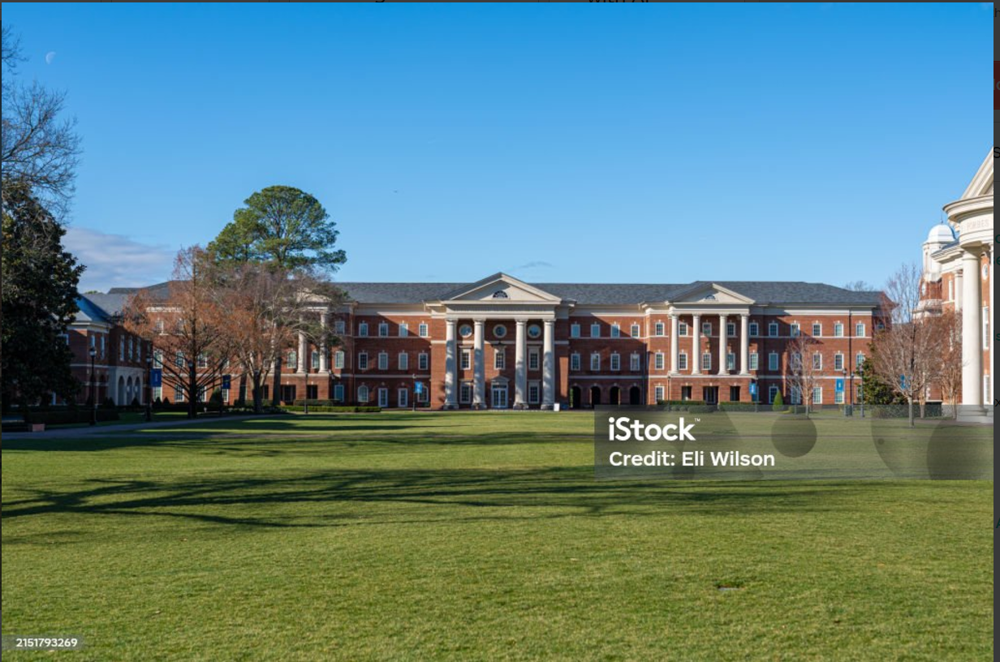

# This is a heading
## This is another heading


Heading one
=====

This is a heading
-------

This is a paragraph

This is another paragraph

---
<!-- This is a comment section -->
**This is bold text**

_This text is bold_

*This text is italic*

_Italic text_

>He said that he will be coming next week
>>Why couldn't he just come this week

### List of contribution

1.Laletty
2.Imani
3. Derrick


<!-- bulleted list -->
*HTML
-CSS
*JAVASCRIPT

```bash
git clone htts://github.com/Kwanusu/jua-kali-connecg.git
```
***
for more information on coding, please visit [Zindua School](https://zinduaschool.com)

music experience


Tables

| Header 1 | Header 2 |
| :------: | :------: |
|Cell 1| Cell 2|

